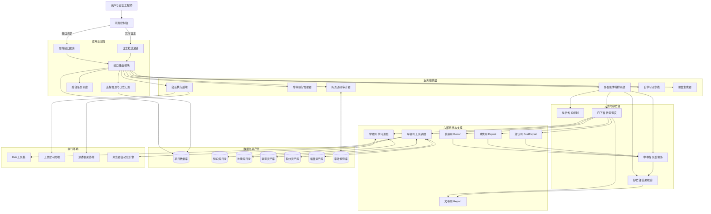
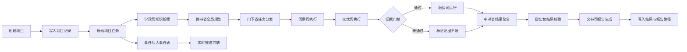
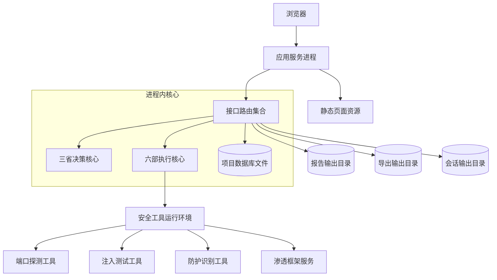
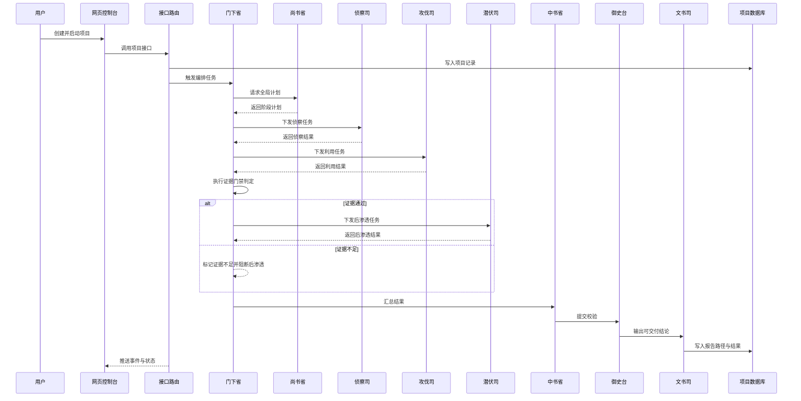

# 雾刃 AI 自动化渗透测试平台（WRAPT）

- 研发单位：玄坤信安科技有限公司
- 所属单位：玄坤信安科技有限公司
- 产品版本：V1.0.0-商业正式版
- 商业产品，禁止任何形式的二次开发，禁止任何形式的盗用任何代码、技术、产品名称等，禁止任何形式的非法传播、非法使用，玄坤信安科技有限公司保留诉讼权利
- 该平台需要基于Kali系统运行，不支持Kali之外的其他系统

---

## 1. 项目定位与目标

雾刃（WRAPT，WuRen AI Automated Penetration Testing Platform）是一个面向授权安全测试与攻防演练场景的 AI 自动化渗透平台。  
它不是“单点扫描器”，而是一个以 **多智能体协作 + 工具执行 + 证据门禁 + 报告闭环** 为核心的端到端系统。

系统目标：

- 输入一个合法目标（IP/域名），自动推进侦察、利用、后渗透、报告流程。
- 将 AI 推理和工具输出统一沉淀为结构化项目状态与事件流水。
- 将“无证据结论”降级为线索，并阻断高风险后续动作，降低误报失控风险。
- 提供可运营的 Web 控制台，支持实时观察、手动干预和结果导出。

---

## 2. 什么是 WRAPT

从工程角度，WRAPT 可以拆成 8 层：

1. **接入层**：WebUI 静态前端 + FastAPI 接口
2. **编排层**：项目生命周期管理、异步任务管理、事件广播
3. **智能体层**：多AI Agent智能体协同运行
4. **执行层**：CLI、会话后端、Kali 工具包装、Web 审计、报告生成
5. **知识层**：RAG（knowledge + skills）、自学习流水线
6. **数据层**：SQLite（项目、事件、导出、设置、会话）
7. **资产层**：漏洞库/指纹库/插件库/规则库 等本地库
8. **运维层**：环境治理、健康检查、后台任务

### 2.1 三省六部制度（平台治理模型）

为避免“单模型单线程决策”带来的失控风险，WRAPT 采用“三省六部”治理模型来组织 AI 决策与执行：

- **三省（决策与监督）**
  - **尚书省（Main Planner）**：全局目标拆解、攻击路径规划、策略优先级定义。
  - **门下省（Coordinator）**：任务编排、上下文接力、阶段调度与状态推进。
  - **中书省（Aggregator）**：多源结果归并、阶段成果提炼、交付输入统一化。
  - **御史台（Verifier）**：对聚合结果进行真实性与可交付性校验，控制幻觉与误判。
- **六部（执行与支撑）**
  - **侦察司（Recon）**：资产发现、指纹识别、服务识别、初始情报沉淀。
  - **攻伐司（Exploit）**：漏洞验证、利用尝试、证据抽取与利用链推进。
  - **潜伏司（PostExploit）**：后渗透、权限巩固、横向移动与会话扩展。
  - **文书司（Report）**：结果编写、风险分级、修复建议与报告产物输出。
  - **军机司（ToolDispatcher 能力层）**：统一工具编排、参数治理、输出规范化。
  - **学政司（RAG + Self-Learning 能力层）**：知识检索、联网学习、经验沉淀与热更新。

> 说明：代码层面已实体化 4 个执行 Agent，其余 2 部由能力层（工具调度与学习进化）承担

---

## 3. 深度系统架构图（组件级）

### 3.1 全链路组件图

### 3.2 运行时数据流图（项目执行）

### 3.3 部署拓扑图（单机默认形态）

### 3.4 运行流程图

---

## 4. 技术栈详情

### 4.1 Python 3.10+

- **用途**：统一后端、AI 编排、工具调度、存储与报告能力。
- **关键价值**：异步生态成熟、与 FastAPI/Pydantic/OpenAI SDK 配套好。

### 4.2 FastAPI

- **用途**：对外 HTTP API + WebSocket + 生命周期管理。
- **关键职责**：
  - 注册 API 路由（`/api`）
  - 挂载静态站点（`/`）
  - 管理启动/关闭后台任务

### 4.3 Uvicorn

- **用途**：ASGI 服务进程。
- **关键职责**：承载 FastAPI、支持 workers、提供网络监听。

### 4.4 Pydantic

- **用途**：请求体/响应体模型与参数校验。
- **关键职责**：
  - ProjectCreate、ExportPolicy、CLIExecuteRequest 等模型约束
  - 限制字段长度、范围、默认值

### 4.5 SQLite

- **用途**：本地持久化与轻量事务存储。
- **关键职责**：
  - 项目主记录与运行状态
  - 事件流水
  - 导出任务与审计
  - WebUI 会话状态
  - 系统设置（key、策略等）

### 4.6 Loguru

- **用途**：统一日志输出并桥接到实时事件流。
- **关键职责**：
  - 控制台日志输出
  - 通过 `log_sink` 转换为前端实时日志事件

### 4.7 OpenAI SDK 兼容层（多 Provider）

- **用途**：对接 DeepSeek 及兼容 OpenAI 协议的模型提供方。
- **关键职责**：
  - 统一对话调用参数
  - 汇总 token usage
  - 支持不同模型名与 base_url

### 4.8 多智能体编排

- **用途**：将一次渗透任务分解成多角色协作链路。
- **关键职责**：
  - 计划、分发、执行、聚合、校验、报告
  - 阶段状态推进与异常处理
  - 证据门禁

### 4.9 RAG（知识检索）

- **用途**：从知识库/技能库召回上下文，辅助决策。
- **关键职责**：
  - 文档加载
  - 索引构建
  - top-k 召回

### 4.10 Self-Learning（自学习）

- **用途**：将外部内容持续沉淀为本地知识/技能条目。
- **关键职责**：
  - ingest text/url
  - 去重与分类
  - 历史查询

### 4.11 WebSocket 实时日志

- **用途**：将运行状态、工具输出、阶段进度实时推送给前端。
- **关键职责**：
  - 管理连接
  - 广播事件
  - 自动回收断链连接

### 4.12 Playwright

- **用途**：浏览器自动化能力（动态页面交互场景）。
- **关键职责**：支持 Web 场景下更深的页面行为探测。

### 4.13 会话后端（workspace/msf 双模式）

- **用途**：统一命令执行与文件操作通道。
- **关键职责**：
  - workspace 模式：本地工作目录执行
  - msf 模式：通过 msfconsole 会话执行
  - 健康检查、返回码/输出提取

### 4.14 Web 源码审计

- **用途**：基于规则库扫描源码暴露内容中的安全风险。
- **关键职责**：规则归一化、规则验证、目标审计执行。

### 4.15 报告生成与导出

- **用途**：把执行结果转为可交付报告产物。
- **关键职责**：
  - Markdown 报告生成
  - latest 查询
  - md/json/html 下载

### 4.16 漏洞库、指纹库、知识库、技能库

- **用途**：构成平台“可执行情报底座”，支撑识别、决策、利用与复盘。
- **关键职责**：
  - 漏洞库：漏洞模板、Exploit-DB 离线检索、同步更新。
  - 指纹库：Web 指纹规则匹配、产品识别与版本线索提取。
  - 知识库：攻防知识文本检索，提供策略参考。
  - 技能库：操作范式与战术模板复用。

### 4.17 WAF 检测与绕过

- **用途**：在漏洞利用前识别防护设备并选择绕过策略。
- **关键职责**：
  - 识别目标是否存在 WAF。
  - 按 WAF 类型返回可用绕过策略。
  - 对候选 payload 进行可行性预检测。
- **价值**：降低直接投递 payload 的拦截概率，提高利用成功率。

### 4.18 自主联网学习与自我进化

- **用途**：在知识不足时主动联网检索，形成新知识并回灌系统。
- **关键职责**：
  - 联网检索并获取外部技术内容。
  - 自学习流水线：清洗、去重、分类写入知识库与技能库。
  - 热更新：新条目可被后续任务检索复用。
- **价值**：让系统在新框架、新漏洞、新场景下持续增强适应力。

### 4.19 浏览器自动化与 HTTP 重放

- **用途**：补齐传统命令行扫描难以覆盖的动态 Web 逻辑场景。
- **关键职责**：
  - 页面交互、元素操作、动态行为观察。
  - 构造并重放 HTTP 请求，验证权限与参数边界。
- **价值**：支持业务逻辑漏洞、鉴权缺陷与流程绕过场景验证。

---

## 5. 功能逐详情

### 5.1 项目管理功能

- 创建项目：校验后写入项目管理
- 启动项目：拉起异步流程
- 暂停/继续/停止：更新状态并控制执行任务
- 删除项目：清理项目记录、事件与会话关联数据

### 5.2 攻击链功能

- 按阶段展示执行状态、摘要、事件数、证据标记
- 从与事件流综合构造可视化数据

### 5.3 会话管理功能

- 打开会话（绑定项目与 shell）
- 读取会话状态与健康检查
- 关闭会话并落库状态
- 可切换 backend（workspace/msf）

### 5.4 文件管理功能

- 上传/下载（会话上下文）
- 路径安全限制（防止越界访问）

### 5.5 终端功能

- 支持 cwd 与 timeout

### 5.6 报告功能

- 手动触发生成
- 读取最近报告
- 多格式下载

### 5.7 库管理功能

- 统一管理
- 支持列目录、读文件、写文件、删文件

### 5.8 自学习功能

- 保存到知识域或技能域
- 历史检索

### 5.9 Web 审计功能

- 规则预校验
- 指定目标执行审计

### 5.10 平台设置功能

- 更新模型
- 更新访问密钥
- 手动触发 Exploit-DB 同步

## 6. 合规与免责声明

- 本项目仅用于合法授权的安全测试、攻防演练与研究用途。
- 严禁对未授权目标实施扫描、利用、控制或破坏行为。
- 使用者需自行承担全部法律与合规责任。
