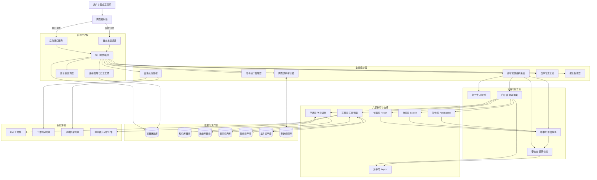
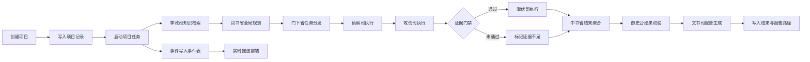
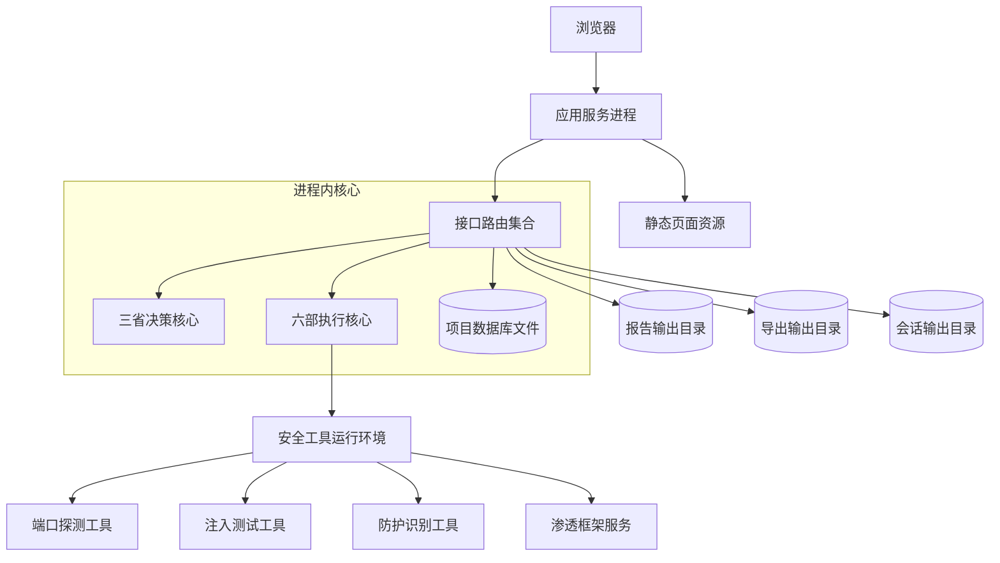
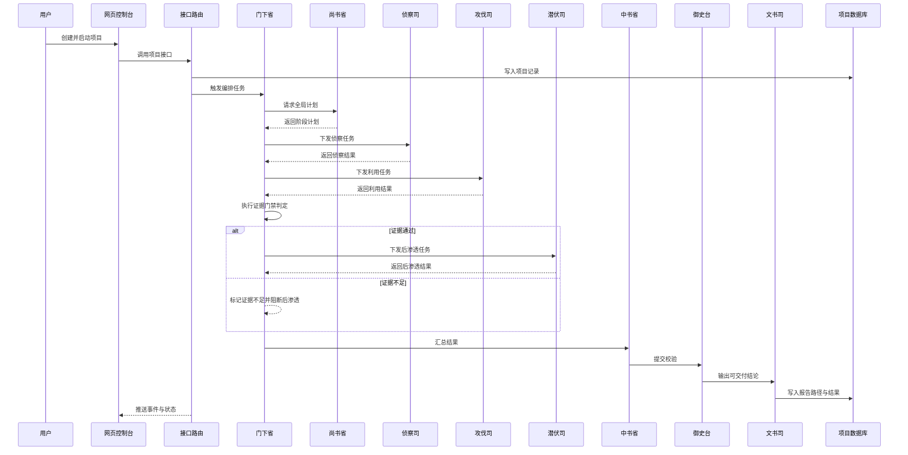

# 雾刃 AI 自动化渗透测试平台（WRAPT）

- 研发单位：玄坤信安科技有限公司
- 所有单位：玄坤信安科技有限公司
- 公司官网：https://www.apateam.top
- 产品下载：https://www.apateam.top
- 产品禁止任何形式的盗用、二次开发、非法使用、非法传播等，玄坤信安科技有限公司保留诉讼权利

---

## 1. 项目定位与目标

雾刃（WRAPT，WuRen AI Automated Penetration Testing Platform）是一个面向授权安全测试与攻防演练场景的 AI 自动化渗透平台。  
它不是“单点扫描器”，而是一个以 **多智能体协作 + 工具执行 + 证据门禁 + 报告闭环** 为核心的端到端系统。

系统目标：

- 输入一个合法目标（IP/域名），自动推进侦察、利用、后渗透、报告流程。
- 将 AI 推理和工具输出统一沉淀为结构化项目状态与事件流水。
- 将“无证据结论”降级为线索，并阻断高风险后续动作，降低误报失控风险。
- 提供可运营的 Web 控制台，支持实时观察、手动干预和结果导出。

---

## 2. 你可以把 WRAPT 理解成什么

从工程角度，WRAPT 可以拆成 8 层：

1. **接入层**：WebUI 静态前端 + FastAPI 接口
2. **编排层**：项目生命周期管理、异步任务管理、事件广播
3. **智能体层**：Main/Coordinator/Recon/Exploit/PostExploit/Aggregator/Verifier/Report
4. **执行层**：CLI、会话后端、Kali 工具包装、Web 审计、报告生成
5. **知识层**：RAG（knowledge + skills）、自学习流水线
6. **数据层**：SQLite（项目、事件、导出、设置、会话）
7. **资产层**：vuldb/fingerprints/plugins/repo 等本地库
8. **运维层**：start.sh 环境治理、健康检查、后台任务

### 2.1 三省六部制度（平台治理模型）

为避免“单模型单线程决策”带来的失控风险，WRAPT 采用“三省六部”治理模型来组织 AI 决策与执行：

- **三省（决策与监督）**
  - **尚书省（Main Planner）**：全局目标拆解、攻击路径规划、策略优先级定义。
  - **门下省（Coordinator）**：任务编排、上下文接力、阶段调度与状态推进。
  - **中书省（Aggregator）**：多源结果归并、阶段成果提炼、交付输入统一化。
  - **御史台（Verifier）**：对聚合结果进行真实性与可交付性校验，控制幻觉与误判。
- **六部（执行与支撑）**
  - **侦察司（Recon）**：资产发现、指纹识别、服务识别、初始情报沉淀。
  - **攻伐司（Exploit）**：漏洞验证、利用尝试、证据抽取与利用链推进。
  - **潜伏司（PostExploit）**：后渗透、权限巩固、横向移动与会话扩展。
  - **文书司（Report）**：结果编写、风险分级、修复建议与报告产物输出。
  - **军机司（ToolDispatcher 能力层）**：统一工具编排、参数治理、输出规范化。
  - **学政司（RAG + Self-Learning 能力层）**：知识检索、联网学习、经验沉淀与热更新。

> 说明：代码层面已实体化 4 个执行 Agent（Recon/Exploit/PostExploit/Report），其余 2 部由能力层（工具调度与学习进化）承担。

---

## 3. 深度系统架构图（组件级）

### 3.1 全链路组件图（含三省六部）



### 3.2 运行时数据流图（项目执行）



### 3.3 部署拓扑图（单机默认形态，含三省六部）



### 3.4 运行流程图（新增，职责视角）



---

## 4. 技术栈逐项拆解（揉碎版）

### 4.1 Python 3.10+

- **用途**：统一后端、AI 编排、工具调度、存储与报告能力。
- **关键价值**：异步生态成熟、与 FastAPI/Pydantic/OpenAI SDK 配套好。
- **落地点**：全仓核心代码。

### 4.2 FastAPI

- **用途**：对外 HTTP API + WebSocket + 生命周期管理。
- **关键职责**：
  - 注册 API 路由（`/api`）
  - 挂载静态站点（`/`）
  - 管理启动/关闭后台任务
- **落地点**：`main.py`、`core/api/routes.py`

### 4.3 Uvicorn

- **用途**：ASGI 服务进程。
- **关键职责**：承载 FastAPI、支持 workers、提供网络监听。
- **落地点**：`start.sh` 启动命令与 `main.py` 本地运行入口。

### 4.4 Pydantic

- **用途**：请求体/响应体模型与参数校验。
- **关键职责**：
  - ProjectCreate、ExportPolicy、CLIExecuteRequest 等模型约束
  - 限制字段长度、范围、默认值
- **落地点**：`core/api/routes.py`。

### 4.5 SQLite

- **用途**：本地持久化与轻量事务存储。
- **关键职责**：
  - 项目主记录与运行状态
  - 事件流水
  - 导出任务与审计
  - WebUI 会话状态
  - 系统设置（key、策略等）
- **落地点**：`core/api/storage.py`，数据库文件 `output/projects/projects.db`。

### 4.6 Loguru

- **用途**：统一日志输出并桥接到实时事件流。
- **关键职责**：
  - 控制台日志输出
  - 通过 `log_sink` 转换为前端实时日志事件
- **落地点**：`main.py`、`core/api/routes.py`。

### 4.7 OpenAI SDK 兼容层（多 Provider）

- **用途**：对接 DeepSeek 、 GLM 、 MiniMax 、 千问及兼容 OpenAI 协议的模型提供方。
- **关键职责**：
  - 统一对话调用参数
  - 汇总 token usage
  - 支持不同模型名与 base_url
- **落地点**：`core/ai/engine.py`、`config/config.yaml`。

### 4.8 多智能体编排

- **用途**：将一次渗透任务分解成多角色协作链路。
- **关键职责**：
  - 计划、分发、执行、聚合、校验、报告
  - 阶段状态推进与异常处理
  - 证据门禁
- **落地点**：`core/ai/coordinator.py`。

### 4.9 RAG（知识检索）

- **用途**：从知识库/技能库召回上下文，辅助决策。
- **关键职责**：
  - 文档加载
  - 索引构建
  - top-k 召回
- **落地点**：`core/ai/rag.py`，数据目录 `knowledge/`、`skills/`。

### 4.10 Self-Learning（自学习）

- **用途**：将外部内容持续沉淀为本地知识/技能条目。
- **关键职责**：
  - ingest text/url
  - 去重与分类
  - 历史查询
- **落地点**：`core/ai/learning.py`，API `/api/webui/learning/*`。

### 4.11 WebSocket 实时日志

- **用途**：将运行状态、工具输出、阶段进度实时推送给前端。
- **关键职责**：
  - 管理连接
  - 广播事件
  - 自动回收断链连接
- **落地点**：`core/api/routes.py`、`webui/static/scripts/app.js`。

### 4.12 Playwright

- **用途**：浏览器自动化能力（动态页面交互场景）。
- **关键职责**：支持 Web 场景下更深的页面行为探测。
- **落地点**：依赖在 `requirements.txt`；运行时由工具链调用；启动脚本安装 Chromium。

### 4.13 会话后端（workspace/msf 双模式）

- **用途**：统一命令执行与文件操作通道。
- **关键职责**：
  - workspace 模式：本地工作目录执行
  - msf 模式：通过 msfconsole 会话执行
  - 健康检查、返回码/输出提取
- **落地点**：`core/modules/session_backend.py`、`/api/webui/projects/*/sessions*`。

### 4.14 Web 源码审计

- **用途**：基于规则库扫描源码暴露内容中的安全风险。
- **关键职责**：规则归一化、规则验证、目标审计执行。
- **落地点**：`core/modules/web_audit.py`、`repo/`、`/api/webui/web-audit/*`。

### 4.15 报告生成与导出

- **用途**：把执行结果转为可交付报告产物。
- **关键职责**：
  - Markdown 报告生成
  - latest 查询
  - md/json/html 下载
- **落地点**：`core/modules/report/generator.py`、`/api/webui/projects/*/reports*`。

### 4.16 漏洞库、指纹库、知识库、技能库

- **用途**：构成平台“可执行情报底座”，支撑识别、决策、利用与复盘。
- **关键职责**：
  - 漏洞库：漏洞模板、Exploit-DB 离线检索、同步更新。
  - 指纹库：Web 指纹规则匹配、产品识别与版本线索提取。
  - 知识库：攻防知识文本检索，提供策略参考。
  - 技能库：操作范式与战术模板复用。
- **能力入口**：
  - 统一库管理接口：`/api/webui/libs/files`、`/api/webui/libs/file`
  - Exploit-DB 同步接口：`/api/system/exploitdb/sync`
  - Agent 检索工具：`query_knowledge_base`、`query_skills_base`

### 4.17 WAF 检测与绕过

- **用途**：在漏洞利用前识别防护设备并选择绕过策略。
- **关键职责**：
  - `detect_waf`：识别目标是否存在 WAF。
  - `find_bypass_strategies`：按 WAF 类型返回可用绕过策略。
  - `test_bypass_feasibility`：对候选 payload 进行可行性预检测。
- **价值**：降低直接投递 payload 的拦截概率，提高利用成功率。

### 4.18 自主联网学习与自我进化

- **用途**：在知识不足时主动联网检索，形成新知识并回灌系统。
- **关键职责**：
  - `self_learning_web_search`：联网检索并获取外部技术内容。
  - 自学习流水线：清洗、去重、分类写入 knowledge/skills。
  - 热更新：新条目可被后续任务检索复用。
- **价值**：让系统在新框架、新漏洞、新场景下持续增强适应力。

### 4.19 浏览器自动化与 HTTP 重放

- **用途**：补齐传统命令行扫描难以覆盖的动态 Web 逻辑场景。
- **关键职责**：
  - `browser_action`：页面交互、元素操作、动态行为观察。
  - `replay_request`：构造并重放 HTTP 请求，验证权限与参数边界。
- **价值**：支持业务逻辑漏洞、鉴权缺陷与流程绕过场景验证。

---

## 5. 功能逐项拆解（从用户动作看系统）

### 5.1 项目管理功能

- 创建项目：校验 target 后写入 `projects`
- 启动项目：拉起 `start_project` 异步流程
- 暂停/继续/停止：更新状态并控制执行任务
- 删除项目：清理项目记录、事件与会话关联数据

### 5.2 攻击链功能

- 按阶段展示执行状态、摘要、事件数、证据标记
- 从 `results.phase_status` 与事件流综合构造可视化数据

### 5.3 会话管理功能

- 打开会话（绑定项目与 shell）
- 读取会话状态与健康检查
- 关闭会话并落库状态
- 可切换 backend（workspace/msf）

### 5.4 文件管理功能

- list/read/write/delete（统一 `files/ops`）
- 上传/下载（会话上下文）
- 路径安全限制（防止越界访问）

### 5.5 终端功能

- 对接 `CLIManager`，支持 cwd 与 timeout
- 返回 stdout/stderr/returncode/duration

### 5.6 报告功能

- 手动触发生成
- 读取最近报告
- 多格式下载

### 5.7 库管理功能

- 统一管理 knowledge/skills/vuldb/fingerprints/plugins/poc_exp/custom_tools/prompts/audit_rules
- 支持列目录、读文件、写文件、删文件

### 5.8 自学习功能

- 输入 topic + content/urls
- 保存到知识域或技能域
- 历史检索（keyword/type/limit/offset）

### 5.9 Web 审计功能

- 规则预校验（可 auto-fix）
- 指定目标执行审计（可选 yak）

### 5.10 平台设置功能

- 更新模型 provider/key/base_url/model
- 更新访问密钥（X-Admin-Key）
- 手动触发 Exploit-DB 同步

---

## 6. 模块职责拆解（按文件）

| 模块/文件 | 主要职责 | 关键点 |
| --- | --- | --- |
| `main.py` | App 组装与生命周期 | 校验 UI 资源、挂载 `/api`、挂载静态站点 |
| `core/api/routes.py` | 业务路由与编排枢纽 | 项目、导出、会话、文件、CLI、报告、学习、审计、设置、WS |
| `core/api/storage.py` | SQLite 数据访问层 | 建表、索引、CRUD、迁移 |
| `core/ai/coordinator.py` | 多智能体中枢 | Agent 初始化、阶段流程、工具循环、证据门禁 |
| `core/ai/engine.py` | 模型调用引擎 | provider/base_url/model 参数归一与调用 |
| `core/ai/rag.py` | 检索引擎 | 文档加载、索引、召回 |
| `core/ai/learning.py` | 自学习管线 | 采集、去重、历史查询 |
| `core/ai/memory.py` | 项目记忆管理 | 短期/长期记忆与清理 |
| `core/modules/session_backend.py` | 会话执行后端 | workspace/msf 双模式执行 |
| `core/modules/cli_manager.py` | 命令执行管理 | 超时、输出、错误处理 |
| `core/modules/web_audit.py` | Web 审计 | 规则校验与扫描执行 |
| `core/modules/report/generator.py` | 报告生成 | Markdown 模板化输出 |
| `webui/static/index.html` | 前端容器模板 | 多视图布局与面板结构 |
| `webui/static/scripts/app.js` | 前端状态机 | API 调用、WS 订阅、轮询与交互 |

---

## 7. 多智能体内部工作机制（详细）

### 7.1 Agent 角色拆解

- **Main Planner**：全局策略规划与目标拆解
- **Coordinator**：把计划转成子任务，分发给执行 Agent
- **Recon**：资产侦察与上下文收集
- **Exploit**：漏洞尝试与证据抓取
- **PostExploit**：后渗透动作（受证据门禁约束）
- **Aggregator**：聚合阶段结果
- **Verifier**：核验结果质量
- **Report**：生成报告摘要与建议

### 7.2 执行状态机

- `recon` → `exploit` → `post_exploit` → `report`
- `exploit` 无有效证据时：`insufficient_evidence`
- `post_exploit` 在证据不足或 exploit 失败时被阻断

### 7.3 证据门禁逻辑

- 通过工具结果抽取验证证据
- 无证据则把 exploit 状态降级为 `insufficient_evidence`
- 继续生成报告，但会带证据缺口提醒

---

## 8. API 全量分域（可直接对接）

基础前缀：`/api`

### 8.1 项目生命周期

- `POST /projects`
- `GET /projects`
- `GET /projects/{project_id}`
- `POST /projects/{project_id}/start`
- `POST /projects/{project_id}/pause`
- `POST /projects/{project_id}/continue`
- `POST /projects/{project_id}/stop`
- `DELETE /projects/{project_id}`
- `POST /webui/projects/{project_id}/control/start`
- `POST /webui/projects/{project_id}/control/pause`
- `POST /webui/projects/{project_id}/control/continue`
- `POST /webui/projects/{project_id}/control/stop`

### 8.2 事件与导出

- `GET /projects/{project_id}/events`
- `GET /projects/{project_id}/events/export`
- `POST /projects/{project_id}/events/export/jobs`
- `GET /projects/{project_id}/events/export/jobs/{job_id}`
- `GET /projects/{project_id}/events/export/jobs/{job_id}/signed-url`
- `POST /projects/{project_id}/events/export/jobs/{job_id}/retry`
- `GET /projects/{project_id}/events/export/jobs/{job_id}/download`
- `DELETE /projects/{project_id}/events/export/jobs/{job_id}`
- `GET /export/jobs`
- `GET /export/jobs/{job_id}/audit`
- `GET /export/audit`
- `GET /export/audit/export`
- `GET /export/policy`
- `PUT /export/policy`
- `POST /export/jobs/batch-delete`
- `POST /export/jobs/cleanup`
- `GET /export/cleanup/runs`
- `GET /export/metrics`

### 8.3 会话与执行

- `GET /webui/projects/{project_id}/attack-chain`
- `GET /webui/projects/{project_id}/shells`
- `GET /webui/session-backend`
- `PUT /webui/session-backend`
- `GET /webui/msf/sessions`
- `GET /webui/projects/{project_id}/sessions`
- `POST /webui/projects/{project_id}/sessions/open`
- `POST /webui/projects/{project_id}/sessions/sync-msf`
- `POST /webui/projects/{project_id}/sessions/{session_id}/close`
- `GET /webui/projects/{project_id}/sessions/{session_id}/status`
- `POST /webui/projects/{project_id}/sessions/{session_id}/health-check`
- `POST /webui/cli/execute`
- `POST /webui/files/ops`
- `POST /webui/files/upload`
- `GET /webui/files/download`

### 8.4 报告、库、学习、审计、设置

- `POST /webui/projects/{project_id}/reports/generate`
- `GET /webui/projects/{project_id}/reports/latest`
- `GET /webui/projects/{project_id}/reports/download`
- `POST /mtools/upload`
- `GET /mtools/list`
- `GET /webui/libs/files`
- `GET /webui/libs/file`
- `PUT /webui/libs/file`
- `DELETE /webui/libs/file`
- `POST /webui/learning/sync`
- `GET /webui/learning/history`
- `POST /webui/web-audit/rules/validate`
- `POST /webui/web-audit/run`
- `GET /webui/settings/apikey`
- `PUT /webui/settings/apikey`
- `GET /webui/settings/access-key`
- `PUT /webui/settings/access-key`
- `GET /webui/audit-metrics`
- `POST /system/exploitdb/sync`
- `WebSocket /api/logs`

---

## 9. Web 控制台拆解（视图级）

视图分组：

- **执行控制**：项目控制台、攻击链、会话管理、文件管理、终端沙盒、渗透报告
- **武器与资产库**：知识库、技能库、漏洞库、指纹库、插件库、POC/EXP、自定义工具、提示词、审计规则
- **扩展功能**：自我学习、Web 源码审计
- **系统管理**：平台设置

前端行为特点：

- 启动后自动拉取项目与会话后端设置
- 通过 WebSocket 实时增量更新日志和状态
- 周期轮询刷新项目/攻击链/报告状态
- 所有关键操作统一通过 `safeRequest` 包装错误处理

---

## 10. 数据模型与状态管理

### 10.1 项目状态

- `pending`：创建未执行
- `running`：执行中
- `paused`：暂停
- `stopped`：停止
- `completed`：完成
- `failed`：失败
- `insufficient_evidence`：证据不足

### 10.2 阶段状态

- `recon`
- `exploit`
- `post_exploit`
- `report`

### 10.3 SQLite 核心表

- `projects`
- `events`
- `export_jobs`
- `export_job_audit`
- `export_cleanup_runs`
- `export_download_tokens`
- `system_settings`
- `webui_sessions`

---

## 11. 资产库规模（仓库文件统计）

> 说明：这是“文件数”统计，不等于“有效漏洞条目数”。

- `fingerprints/`：2403
- `plugins/`：1558
- `repo/`：385
- `skills/`：998
- `knowledge/`：49
- `vuldb/`：55188

---

## 12. 安装、启动与运维

### 12.1 推荐环境

- 推荐：Kali Linux
- Python：3.10+
- 建议启用：`--admin-key`

### 12.2 快速启动

```bash
chmod +x start.sh
./start.sh --host 127.0.0.1 --port 8000
```

生产示例：

```bash
./start.sh --host 0.0.0.0 --port 8000 --workers 2 --admin-key "ReplaceWithStrongKey"
```

### 12.3 start.sh 覆盖能力

- 系统识别（默认要求 Kali）
- 系统依赖检查与自动安装（可关闭）
- Python 虚拟环境创建与依赖安装
- Playwright Chromium 安装
- Yak 运行时安装尝试
- postgresql/msfdb 启动尝试
- UI 资源完整性检查
- AI/RAG 预热
- Uvicorn 启动 + 健康检查

### 12.4 常用参数

- `--host` `--port` `--workers`
- `--admin-key`
- `--allow-non-kali`
- `--no-auto-install`
- `--skip-pip-install`
- `--no-auto-services`
- `--no-ai-warmup`
- `--strict-deps`

---

## 13. 安全模型与风险控制

### 13.1 鉴权策略

- 配置了 `webui_access_key` 或 `WRAPT_WEBUI_ACCESS_KEY` 时，需要 `X-Admin-Key`
- 未配置时，部分接口可匿名访问

### 13.2 访问控制建议

- 仅在隔离网络或授权演练环境部署
- 生产必须开启访问密钥并限制来源
- 建议前置反向代理、TLS、ACL

### 13.3 默认风险点

- CORS 默认 `*`，应在生产收敛
- 平台具备攻击自动化能力，必须遵守授权边界

---

## 14. 已知实现注意事项

1. `POST /webui/files/upload` 当前实现引用 `db_get_session`，该符号未在当前路由依赖导入中定义，建议先修复后在生产启用。
2. `config/config.yaml` 示例存在测试样例 key，必须在部署后立即替换。
3. 目标校验只接受纯 IP/域名，不接受带协议/路径/query 的 URL。

---

## 15. 故障排查速查表

| 现象 | 快速检查点 | 处理建议 |
| --- | --- | --- |
| 页面空白 | `webui/static` 关键文件是否齐全 | 检查 `index.html/app.css/tailwind.generated.css/app.js` |
| API 401 | `X-Admin-Key` 是否与服务端一致 | 检查设置页 access key 与环境变量 |
| 证据不足阻断 | exploit 工具结果是否包含可验证证据 | 补充验证后重跑 |
| 浏览器能力异常 | Playwright Chromium 是否安装 | 重新安装 Playwright runtime |
| 会话异常 | 会话状态与 health-check 返回 | 重建或同步会话 |
| 导出失效 | signed-url 是否过期或已消费 | 重新签发下载链接 |

---

## 16. 二次开发指南（实操导向）

### 16.1 新增 API

1. 在 `core/api/routes.py` 添加模型和路由
2. 需要落库时扩展 `core/api/storage.py`
3. 在 `webui/static/scripts/app.js` 接入前端交互
4. 对关键动作增加审计事件

### 16.2 新增智能体能力

1. 在 `core/ai/coordinator.py` 定义新 Agent 或流程节点
2. 在 prompt/tool schema 层补齐能力描述
3. 调整阶段状态推进与错误处理
4. 回归验证证据门禁逻辑

### 16.3 新增资产库类型

1. 配置 `config/config.yaml -> paths`
2. 扩展路由中的库类型映射
3. 扩展前端库视图映射与 UI 入口

---

## 17. 合规与免责声明

- 本项目仅用于合法授权的安全测试、攻防演练与研究用途。
- 严禁对未授权目标实施扫描、利用、控制或破坏行为。
- 使用者需自行承担全部法律与合规责任。

---

## 18. 快速入口

- 服务主页：`http://<host>:<port>/`
- 项目接口：`/api/projects`
- 实时日志：`/api/logs`
- Exploit-DB 同步：`/api/system/exploitdb/sync`

---

## 19. 后续可继续增强的文档方向

1. 为每个 API 增加请求/响应 JSON 示例
2. 为每个 WebUI 页面增加“操作步骤 + 效果截图”
3. 增加“单机部署/内网部署/网关前置部署”三套模板
4. 增加“典型演练剧本”与“失败复盘案例”
5. 增加“性能压测与容量规划”章节
